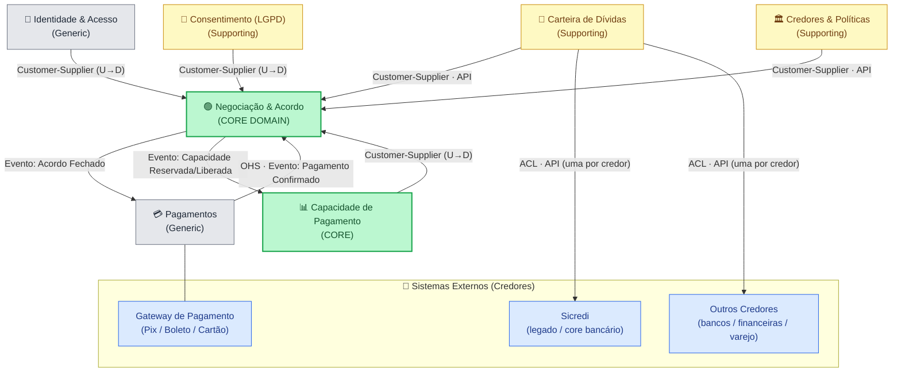
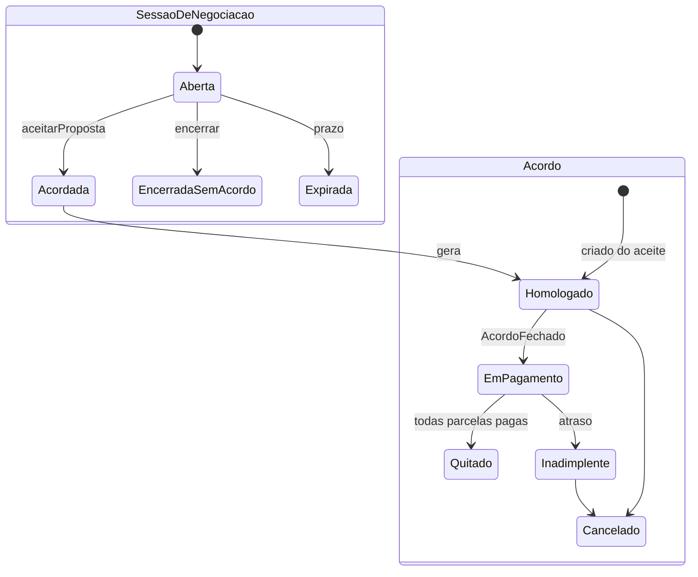
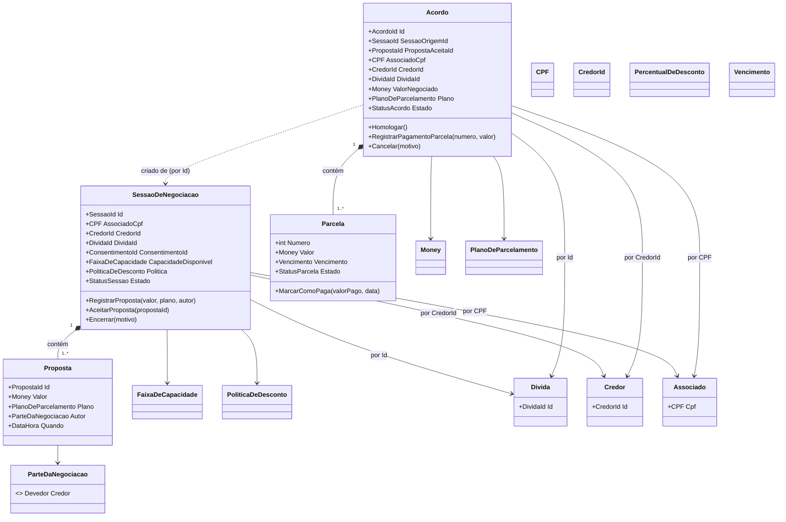

# 🏦 QUITAFLEX — Design Estratégico + Tático (DDD) · Entrega Final v4

> **Disciplina:** Domain-Driven Design — Design Estratégico (Aula 3) + Design Tático (Aula 4)
> **Cliente de referência:** Sicredi
>
> 📌 **Esta é a versão v4.** Ela preserva o Design Estratégico (v3) e **acrescenta o Design Tático** (Parte II). A versão anterior (`QUITAFLEX-Entrega-Final-v3.md`) permanece intacta.
>
> 🔄 **Mudança de escopo nesta v4: a QUITAFLEX passa a ser MULTI-CREDOR.** Além das dívidas do próprio Sicredi, a plataforma agrega e negocia dívidas do associado em **outras instituições** (bancos, financeiras, varejo). O Sicredi atua como o canal que ajuda seu associado a recuperar a autonomia financeira **completa** — não só a dívida interna. Os pontos afetados pela mudança estão marcados com 🔄.

# Participantes 

370265 - Raione Weslley B. Nascimento<br>
373762 - Gustavo Lima de Oliveira Carvalho<br>
371826 - Igor Borges da Silva<br>
370757 - Nicole Calgaroto<br>
371368 - Paulo Roberto da Silva<br>
372951 - Matheus Sanches Garcia<br>
373249- Ítalo Almeida<br>

---

# PARTE I — Design Estratégico (DDD)

## 1. Nome do Projeto

**QUITAFLEX** — Plataforma de negociação e quitação de dívidas (multi-credor).

---

## 2. Objetivo Principal do Projeto

Criar um ambiente digital de **negociação inteligente e humanizada** que ajuda o **associado** do Sicredi a **recuperar sua autonomia financeira**, oferecendo acordos sustentáveis baseados em sua **capacidade real de pagamento**, com **transparência, ética e proteção de dados (LGPD)** — convertendo dívidas em **quitações reais** e em **relacionamento de longo prazo**.

🔄 **Visão multi-credor:** o associado raramente deve a uma só instituição. A QUITAFLEX consolida as dívidas dele em **múltiplos credores** (Sicredi e parceiros externos) e negocia cada uma respeitando uma **capacidade de pagamento total** que é **rateada** entre todos os credores — evitando que o associado feche acordos que, somados, ele não consegue cumprir.

Foco da solução:
- ♻️ **Recuperação de crédito** com acordos que se sustentam
- 📉 **Redução de perdas** e de reincidência
- 🤝 **Melhoria do relacionamento** com os associados
- 📊 **Análise da capacidade real de pagamento** (🔄 rateada entre credores)
- ⚖️ **Negociação ética e transparente**
- 🔐 **Proteção de dados e conformidade com a LGPD**

---

## 3. Identificação dos Subdomínios

| **Subdomínio** | **Descrição** | **Tipo** |
|----------------|---------------|----------|
| **Negociação & Acordo** | Lista dívidas, troca propostas, fecha o **Acordo** e orquestra a **homologação** e a **quitação**. Core da plataforma. | 🟢 **Core Domain** |
| **Análise de Capacidade de Pagamento** | Estima quanto o associado consegue pagar e 🔄 **rateia** essa capacidade entre os vários credores, para gerar propostas realistas, éticas e compatíveis. | 🟢 **Core Domain** |
| **Consolidação & Elegibilidade de Dívidas** | 🔄 Consolida as dívidas do associado vindas de **múltiplas instituições** (Sicredi + bancos/financeiras parceiras), aplica as regras de **elegibilidade** e reconcilia o estado com cada core legado. | 🟡 **Supporting** |
| 🔄 **Credores & Políticas de Negociação** | Cadastro dos **credores** parceiros e das **políticas** de cada um: faixas de desconto permitidas, alçada de homologação, prazos máximos. | 🟡 **Supporting** |
| **Consentimento & LGPD** | Registra e verifica o consentimento do associado, finalidade de uso e trilha de auditoria. | 🟡 **Supporting** |
| **Gestão de Pagamentos** | Processa pagamentos dos acordos via Pix, boleto, cartão ou integração bancária. | ⚪ **Generic** |
| **Autenticação & Identidade** | Login, identificação do associado por CPF, permissões e segurança de acesso. | ⚪ **Generic** |

> **Por que dois Cores?** O diferencial competitivo não é só "fechar acordo", mas **fechar o acordo certo** — aquele que o associado consegue cumprir. 🔄 No mundo multi-credor isso fica ainda mais crítico: a Capacidade precisa ser **rateada** entre todos os credores, senão o associado superaloca a própria renda.

---

## 4. Desenho dos Bounded Contexts

| **Bounded Context** | **Responsabilidade** | **Subdomínios Relacionados** |
|---------------------|----------------------|------------------------------|
| **Contexto de Negociação** | Lista dívidas, executa simulações, troca propostas, fecha e orquestra a homologação e a quitação do **Acordo**. | Negociação & Acordo (Core) |
| **Contexto de Capacidade de Pagamento** | Calcula a capacidade do associado, 🔄 controla a **capacidade reservada/disponível** por credor e recomenda faixas sustentáveis. | Análise de Capacidade (Core) |
| **Contexto de Carteira de Dívidas** | 🔄 Consolida e reconcilia dívidas de **vários credores**, determina **elegibilidade** e protege seu modelo do legado de cada instituição via **ACL** (uma por origem). | Consolidação & Elegibilidade de Dívidas |
| 🔄 **Contexto de Credores & Políticas** | Mantém o cadastro de credores e suas políticas de desconto/alçada; fornece à Negociação os limites válidos por credor. | Credores & Políticas de Negociação |
| **Contexto de Consentimento (LGPD)** | Registro/verificação de consentimento, finalidade e auditoria. | Consentimento & LGPD |
| **Contexto de Pagamentos** | Geração de cobranças e conciliação (Pix, boleto, cartão). | Gestão de Pagamentos |
| **Contexto de Identidade & Acesso** | Autenticação do associado, identificação por CPF, permissões. | Autenticação & Identidade |

---

## 5. Comunicação entre os Bounded Contexts

| **De (Origem)** | **Para (Destino)** | **Forma de Comunicação** | **Exemplo de Evento/Chamada** | **Padrão (Context Mapping)** |
|-----------------|--------------------|--------------------------|-------------------------------|------------------------------|
| Identidade & Acesso | Negociação | API (síncrono) | Validar token / obter associado por CPF | Customer-Supplier (U→D) |
| Consentimento (LGPD) | Negociação | API + Evento | "Consentimento Concedido" / verificar consentimento válido | Customer-Supplier (U→D) |
| Capacidade de Pagamento | Negociação | API (síncrono) | 🔄 Obter capacidade **disponível** do associado (total − reservada por outros acordos) | Customer-Supplier (U→D) |
| Carteira de Dívidas | Negociação | API (síncrono) | Fornecer dívidas consolidadas e elegíveis (🔄 de vários credores) | Customer-Supplier (U→D) |
| 🔄 Credores & Políticas | Negociação | API (síncrono) | Obter política de desconto/alçada do credor da dívida | Customer-Supplier (U→D) |
| Carteira de Dívidas | 🔄 Sistemas dos Credores (Sicredi + bancos parceiros) | API (síncrono) | Consultar dívidas, enviar propostas e sincronizar status em **cada** core legado | Anticorruption Layer (ACL) — **uma por credor** |
| Negociação | Pagamentos | Mensageria (Evento) | "Acordo Fechado" | Customer-Supplier (U→D) |
| Negociação | 🔄 Capacidade de Pagamento | Mensageria (Evento) | 🔄 "Capacidade Reservada" / "Capacidade Liberada" (atualiza o rateio) | Customer-Supplier (U→D) |
| Pagamentos | Negociação | Mensageria (Evento) | "Pagamento Confirmado" / "Pagamento Falhou" → conclui a **Quitação** | Open Host Service (OHS) |

> **Sem Shared Kernel:** os contextos referenciam o associado por **CPF/ID** e o credor por **CredorId**, em vez de compartilhar um modelo comum — reduz acoplamento e permite evolução independente.
>
> 🔄 **ACL por credor:** cada instituição parceira tem seu próprio legado; a **Carteira de Dívidas** mantém uma **camada anticorrupção por origem**, traduzindo cada modelo externo para o modelo limpo que a Negociação consome.
>
> 🔄 **Por que eventos "Capacidade Reservada/Liberada"?** Como cada acordo é um agregado separado (e pode ser de credores diferentes), a regra "soma dos acordos ≤ capacidade total" é garantida por **consistência eventual**: ao fechar um acordo, a Negociação avisa a Capacidade para reservar; ao quitar/cancelar, libera.

---

## 6. Definição da Linguagem Ubíqua

| **Termo** | **Descrição** |
|-----------|---------------|
| **Associado / Devedor** | Pessoa física com uma ou mais dívidas vinculadas ao seu CPF que deseja consultar, simular ou propor uma negociação. Tratado como parceiro na recuperação, não como inadimplente. |
| 🔄 **Credor** | Instituição que detém a dívida (Sicredi, banco, financeira, varejista) e define as **políticas** de negociação aplicáveis. É uma das duas **partes** da negociação. |
| 🔄 **Dívida** | Obrigação financeira em atraso vinculada ao CPF, **originada em um credor** (Sicredi **ou** outra instituição parceira). |
| 🔄 **Política de Negociação** | Regras do credor para uma dívida: desconto máximo, número máximo de parcelas, alçada de homologação. |
| **Consentimento LGPD** | Autorização do associado para que seus dados sejam consultados, tratados e usados para fins de simulação e negociação. |
| **Capacidade de Pagamento** | Estimativa do quanto o associado consegue pagar por mês. 🔄 É **total** (toda a folga financeira) e vai sendo **reservada** a cada acordo fechado. |
| 🔄 **Capacidade Disponível** | Parte da capacidade total ainda **não comprometida** com acordos ativos. Base para validar um novo acordo. |
| **Simulação** | Cálculo prévio de cenários de quitação (à vista ou parcelado), sem compromisso. |
| **Proposta** | Oferta de negociação (valor, parcelas, condições) enviada por uma das **partes** (Devedor ou Credor) **dentro de uma Sessão de Negociação**. |
| 🔄 **Sessão de Negociação** | O processo/contêiner onde as **Propostas** sobre uma dívida são trocadas até haver aceite ou encerramento. Pode terminar **sem** acordo. |
| **Acordo** | Resultado de uma **Proposta aprovada**: valor negociado, parcelas, vencimentos e condições. Nasce **depois** do aceite. |
| **Homologação** | Validação formal do acordo junto ao sistema do credor, tornando-o oficial. |
| **Quitação** | Estado em que a dívida é liquidada após o cumprimento integral do acordo. **Métrica de sucesso do domínio.** |

---

## 7. Estratégia de Desenvolvimento

| **Subdomínio** | **Tipo** | **Estratégia** | **Ferramentas ou Serviços** |
|----------------|----------|----------------|------------------------------|
| **Negociação & Acordo** | Core | Desenvolvimento interno, com foco total (é o diferencial). | — |
| **Análise de Capacidade de Pagamento** | Core | Desenvolvimento interno (motor de score, regras e 🔄 rateio entre credores). | — |
| **Consolidação & Elegibilidade de Dívidas** | Supporting | Interno (regras de consolidação/elegibilidade), 🔄 com ACL sobre as APIs de **cada credor**. | APIs do Sicredi + parceiros |
| 🔄 **Credores & Políticas de Negociação** | Supporting | Interno (cadastro de credores e motor de políticas/alçadas). | — |
| **Consentimento & LGPD** | Supporting | Interno, podendo apoiar-se em ferramenta de gestão de consentimento. | Ferramenta de Consent Management |
| **Gestão de Pagamentos** | Generic | Terceirizar via gateway de mercado ou solução bancária. | Pix / Stripe / PagSeguro / gateway |
| **Autenticação & Identidade** | Generic | Usar solução de mercado de IAM. | Auth0 / Keycloak |

---

## 8. Diagrama Visual (Estratégico)



---
---

# PARTE II — Design Tático (DDD)

> **Foco:** Core Domain **Negociação & Acordo**.
> **Decisão central de modelagem (resolve a ambiguidade Proposta × Acordo):** dois agregados separados —
> **`SessaoDeNegociacao`** (onde as `Proposta`s são trocadas) e **`Acordo`** (o contrato que nasce do aceite).
> Os nomes são distintos de propósito: "Negociação" já é o **subdomínio** e o **bounded context**; o agregado se chama **`SessaoDeNegociacao`** para evitar colisão de nível.

## 🩺 1) Sobre o Domínio Escolhido

**Nome do domínio (subdomínio):** **Negociação & Acordo** (Core Domain).
**Objetivo do sistema:** Converter dívidas (🔄 de múltiplos credores) em **quitações reais**, fechando acordos dentro da **capacidade real e disponível** do associado e em conformidade com a **LGPD**.
**Principais atores / partes:** **Devedor** (Associado), **Credor** (Sicredi ou parceiro), Atendente/Bot de Negociação, Sistema de Capacidade, Sistema de Pagamentos.
**Contextos relacionados:** Negociação (este), Capacidade de Pagamento, Carteira de Dívidas, Credores & Políticas, Consentimento (LGPD), Pagamentos, Identidade & Acesso.

---

## 🧩 2) Entidades vs Value Objects

| Elemento | Tipo | Por quê? (identidade/imutável) |
|---|---|---|
| **SessaoDeNegociacao** | **Entidade (Aggregate Root)** | Tem identidade (`SessaoId`) e ciclo de vida próprio (Aberta → Acordada/Encerrada). Segura o histórico de propostas. |
| **Proposta** | **Entidade (interna à Sessão)** | Há um vai-e-vem de ofertas; cada uma tem identidade (`PropostaId`), autor e momento — precisa ser distinguível. Não vive fora da Sessão. |
| **Acordo** | **Entidade (Aggregate Root)** | Identidade própria (`AcordoId`) e ciclo de vida **longo e independente** (Homologado → Quitado). Referenciado por outros contextos (Pagamentos). |
| **Parcela** | **Entidade (interna ao Acordo)** | Cada parcela tem identidade (`numero`) e estado próprio (pendente/paga/atrasada). |
| **CPF** | **VO** | Imutável, igualdade por valor; identifica o **Devedor**. Encapsula validação. |
| 🔄 **CredorId** | **VO** | Identificador imutável do **Credor**; igualdade por valor. |
| 🔄 **ParteDaNegociacao** | **VO (enum)** | `Devedor \| Credor`. Diz **quem** fez cada proposta. Imutável. |
| **Money** | **VO** | Imutável, igualdade por valor (`valor` + `moeda`); centraliza arredondamento. |
| **PlanoDeParcelamento** | **VO** | Imutável: `quantidadeDeParcelas`, `valorDaParcela`, `periodicidade`. |
| **FaixaDeCapacidade** | **VO** | Imutável: capacidade mensal **disponível** considerada na decisão (snapshot). |
| 🔄 **PoliticaDeDesconto** | **VO** | Snapshot imutável da política do credor: `descontoMaximo`, `parcelasMaximas`, `alcada`. |
| **PercentualDeDesconto** | **VO** | Imutável; encapsula `0% ≤ p ≤ descontoMaximo da política`. |
| **Vencimento** | **VO** | Imutável; data de vencimento de cada parcela, comparada por valor. |

> Todos os VOs são **imutáveis** e com **igualdade por valor** — nada de "string de CPF" ou "decimal de dinheiro".

---

## 🏗️ 3) Agregados e Aggregate Roots

### 🅰️ Agregado 1 — `SessaoDeNegociacao` (AR)

**Conteúdo interno:**
- **Proposta** (histórico + a aceita) — Entidade interna
- **PoliticaDeDesconto** (snapshot do credor) — VO
- **FaixaDeCapacidade** (snapshot disponível no início) — VO

**Referências por ID (outros agregados/contextos):**
- **AssociadoCpf / CPF** (Identidade) — o **Devedor**
- 🔄 **CredorId** (Credores & Políticas) — o **Credor**
- **DividaId** (Carteira de Dívidas)
- **ConsentimentoId** (Consentimento/LGPD)

**Boundary:** Proposta/Política/Faixa entram porque a invariante "proposta válida = respeita capacidade disponível **e** política do credor" precisa ser garantida **na hora do aceite**, dentro de uma transação. Devedor, Credor, Dívida e Consentimento ficam **fora** (outros BCs) → só ID.

### 🅱️ Agregado 2 — `Acordo` (AR)

**Conteúdo interno:**
- **Parcela[]** — Entidades internas
- **PlanoDeParcelamento**, **Money** (valorNegociado), **PercentualDeDesconto**, **StatusDoAcordo** — VOs

**Referências por ID:**
- 🔄 **SessaoDeNegociacaoId** + **PropostaAceitaId** (origem do acordo)
- **AssociadoCpf / CPF**, 🔄 **CredorId**, **DividaId**

**Boundary:** Parcelas entram porque a invariante "Σ parcelas = valor negociado" exige consistência transacional. O `Acordo` faz **snapshot** dos valores da proposta aceita e passa a ser a **fonte única da verdade** do contrato.

> ⚠️ **Regra que cruza agregados (multi-credor):** "a soma das parcelas mensais dos **acordos ativos** do associado ≤ capacidade **total**" envolve **vários `Acordo`s de credores diferentes** → não cabe em um único agregado. É garantida por **Serviço de Domínio + consistência eventual** (ver seção 4 e o serviço `AlocadorDeCapacidade`).

---

## 🧭 4) Invariantes e Máquina de Estados

**Invariantes locais (dentro de um agregado, transacionais):**
1. **Σ parcelas = valor negociado** do acordo.
2. **Nenhuma parcela > `FaixaDeCapacidade` disponível** considerada na proposta.
3. 🔄 **Proposta respeita a `PoliticaDeDesconto` do credor** (desconto ≤ máximo, parcelas ≤ máximo).
4. **Não se aceita proposta sem `Consentimento LGPD` válido** vigente.
5. **Só há acordo sobre dívida elegível** (confirmado pela Carteira).
6. **Acordo imutável após `Quitado`/`Cancelado`**.
7. **Vencimentos estritamente crescentes**; 1ª parcela ≥ data de fechamento.

🔄 **Invariante de consistência eventual (entre agregados):**
8. **Σ (parcela mensal de cada acordo ativo do associado) ≤ Capacidade total.** Garantida pelo serviço `AlocadorDeCapacidade`, via reserva/liberação de capacidade (eventos `CapacidadeReservada`/`CapacidadeLiberada`).

**Máquinas de estado (duas, independentes):**
```
SessaoDeNegociacao:
  Aberta ──aceitarProposta──> Acordada ──cria──> (novo Acordo)
     │
     ├──> EncerradaSemAcordo   (associado desiste / sem consenso)
     └──> Expirada             (prazo da sessão estourou)
  Regras:
  - registrarProposta: permitido só em Aberta; valida política do credor.
  - aceitarProposta: exige consentimento válido + capacidade disponível + serviço Capacidade.

Acordo:
  Homologado ──> EmPagamento ──> Quitado
       │              │
       │              └──> Inadimplente ──> Cancelado
       └──> Cancelado
  Regras:
  - nasce já Homologado (após aceite + homologação junto ao credor).
  - Homologado -> EmPagamento: ao publicar "Acordo Fechado" para Pagamentos.
  - EmPagamento -> Quitado: quando TODAS as parcelas estiverem pagas.
  - * -> Cancelado: permitido antes de Quitado; bloqueado depois.
  - alteração BLOQUEADA se estado em {Quitado, Cancelado}.
```



---

## 🗃️ 5) Repositórios (interfaces)

> Cada repositório trabalha **apenas com sua AR**. Consultas analíticas (ex.: "total quitado no mês", "capacidade reservada do associado") ficam em **read models**.

```csharp
public interface ISessaoDeNegociacaoRepository
{
    Task<SessaoDeNegociacao?> ObterPorIdAsync(SessaoId id, CancellationToken ct = default);
    Task<SessaoDeNegociacao?> ObterAbertaPorDividaAsync(DividaId dividaId, CancellationToken ct = default);
    Task AdicionarAsync(SessaoDeNegociacao sessao, CancellationToken ct = default);
    Task SalvarAsync(SessaoDeNegociacao sessao, CancellationToken ct = default);
}

public interface IAcordoRepository
{
    Task<Acordo?> ObterPorIdAsync(AcordoId id, CancellationToken ct = default);
    // Regra: 1 acordo ativo por dívida
    Task<Acordo?> ObterAtivoPorDividaAsync(DividaId dividaId, CancellationToken ct = default);
    Task AdicionarAsync(Acordo acordo, CancellationToken ct = default);
    Task SalvarAsync(Acordo acordo, CancellationToken ct = default);
}
```

🔄 **Serviço de Domínio (regra que cruza agregados):**
```csharp
// Garante a invariante #8: capacidade total não pode ser superalocada entre credores.
public interface IAlocadorDeCapacidade
{
    // Quanto da capacidade do associado ainda está livre (total - reservada por acordos ativos)
    Task<Money> CapacidadeDisponivelAsync(CPF associado, CancellationToken ct = default);
    Task ReservarAsync(CPF associado, AcordoId acordo, Money parcelaMensal, CancellationToken ct = default);
    Task LiberarAsync(CPF associado, AcordoId acordo, CancellationToken ct = default);
}
```

---

## 📣 6) Eventos de Domínio

Publicados preferencialmente **pós-commit**.

| Evento | Quando ocorre | Payload mínimo | Interno/Integração | Observações |
|---|---|---|---|---|
| **PropostaRegistrada** | Nova oferta/contraoferta na sessão | `sessaoId`, `propostaId`, `autor`, `valor`, `plano` | **Interno** | `autor` = Devedor\|Credor. Alimenta histórico. |
| **PropostaAceita** | Devedor/credor aceita uma proposta | `sessaoId`, `propostaId`, `cpf`, `credorId`, `dividaId`, `valor`, `plano` | **Interno** | Dispara a criação do `Acordo`. |
| **AcordoFechado** | Acordo criado e homologado | `acordoId`, `cpf`, 🔄 `credorId`, `dividaId`, `valorNegociado`, `plano` | **Integração** | Consumido por **Pagamentos**. Idempotente por `acordoId`. |
| 🔄 **CapacidadeReservada** | Ao fechar o acordo | `cpf`, `acordoId`, `parcelaMensal` | **Integração** | Consumido pela **Capacidade** p/ atualizar o rateio. Idempotente por `acordoId`. |
| **ParcelaQuitada** | Pagamento de uma parcela confirmado | `acordoId`, `numeroParcela`, `valorPago`, `data` | **Interno** | Idempotente por (`acordoId`,`numero`). |
| **DividaQuitada** | Última parcela paga (acordo → Quitado) | `acordoId`, `cpf`, 🔄 `credorId`, `dividaId`, `data` | **Integração** | **Métrica de sucesso.** Dispara `CapacidadeLiberada` e baixa no credor. Idempotente. |

---

## 🗺️ 7) Diagrama Tático (Mermaid)

> Dois agregados (`SessaoDeNegociacao` + `Acordo`), suas entidades internas, VOs e referências por **ID** a outros contextos (Devedor via `CPF`, Credor via `CredorId`, Dívida, etc.).



---

## ✅ Checklist de Aceitação

- [x] **VOs imutáveis** e com **igualdade por valor** (`CPF`, `CredorId`, `ParteDaNegociacao`, `Money`, `PlanoDeParcelamento`, `FaixaDeCapacidade`, `PoliticaDeDesconto`, `PercentualDeDesconto`, `Vencimento`).
- [x] **Ambiguidade Proposta × Acordo resolvida:** `Proposta` é entidade interna da `SessaoDeNegociacao`; `Acordo` é agregado próprio que nasce do aceite (sem duplicar valores — faz snapshot).
- [x] **As duas partes (Devedor e Credor)** aparecem como **referência por ID** (`CPF`, `CredorId`) e como **`Autor`** (`ParteDaNegociacao`) de cada proposta.
- [x] 🔄 **Multi-credor**: `CredorId` de 1ª classe, ACL por credor, e invariante de **capacidade rateada** entre acordos.
- [x] **Boundary pequeno** e **invariantes claras** (locais + a de consistência eventual entre agregados).
- [x] **Domínio rico**: operações de negócio como métodos (`RegistrarProposta`, `AceitarProposta`, `Homologar`, `RegistrarPagamentoParcela`, `Cancelar`) — sem `set` aberto.
- [x] **Repositórios só com a AR** (`ISessaoDeNegociacaoRepository`, `IAcordoRepository`) + serviço de domínio `IAlocadorDeCapacidade` para a regra que cruza agregados.
- [x] **Eventos de domínio** com payload mínimo, pós-commit e distinção Interno/Integração.

---

## Event Storming


**Contextos**

**Negociação e Acordo** 


--
**Pagamentos**


--


**📢 Entrega Final — QUITAFLEX | Design Estratégico + Tático DDD (multi-credor) 🚀**
